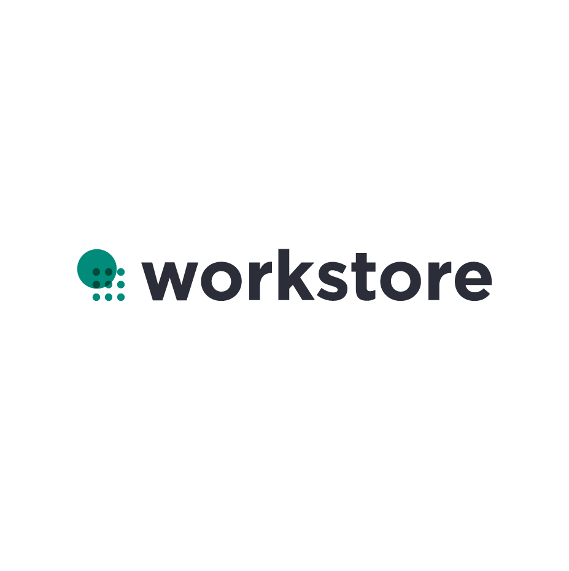

# ANGELHACK 해커톤

</img>

* Demo [https://www.youtube.com/watch?v=q28FG38qDJA&feature=youtu.be&app=desktop]
* 데모 시연 영상 2분 45초부터 볼 수 있습니다.

### 실행 
> git clone -> cd 폴더 -> npm install -> npm start

## WorkStore - owner Client
> 미운영 시간에 공간을 공유하고 추가 수익과 가게 홍보 효과를 누리세요.
> O2O 서비스 

### 소상공인
>1.점포 유휴 자산을 활용하여 부가수익 창출    
>2.간편한 공간 등록 절차    
>3.무인 서비스로 인건비 부담 없음    
>4.제휴 업체로 노출되어 홍보 효과    
>5.운영 홍보비 절감 (예약 성사에 대한 수수료 부과)

### 프리랜서, 스타트업
>1.점포 미운영시간 일, 월 단위 예약     
>2.집 근처 가까운 점포 이용    
>3.언택트 소비 - 미 운영시간 QR코드로 출입 관리    
>4.다양한 점포 외식 할인 혜택   

## Skill Set

+ React hooks
+ Typescript
+ styled-components
+ React-Router v5
+ React-redux
+ redux-thunk
+ react-icons
+ axios